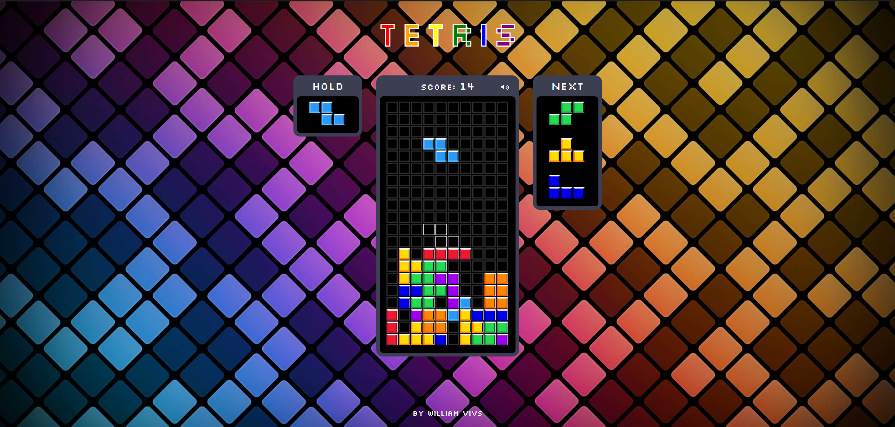
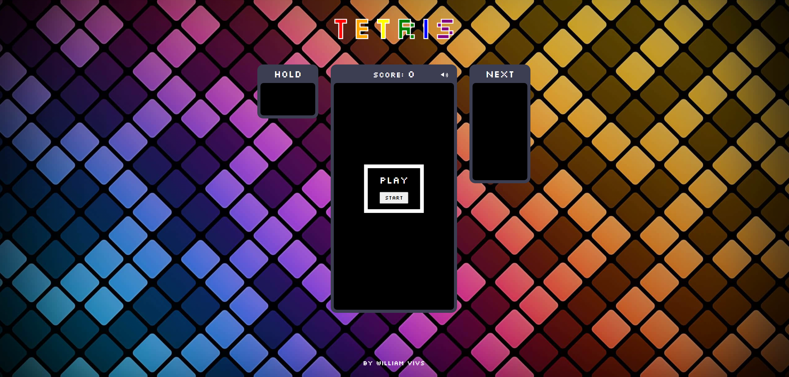

# 🎮 Tetris Web App – Classic Puzzle Game in the Browser

👉 **[LIVE DEMO HERE](tetris-sandy-delta.vercel.app)** <!-- Replace with your live link -->

Welcome to my web-based version of **Tetris**, one of the most iconic puzzle games ever made!  
This project was built completely from scratch using **pure HTML, CSS, and JavaScript**, with no external libraries or frameworks.


## 🕹️ Features

✅ Classic gameplay true to the original  
✅ Score tracking
✅ Music effects
✅ Retro visuals

> 💡 **No frameworks or libraries used.** This is a fully vanilla JavaScript implementation of Tetris.

---

## 📸 Screenshots

#### 🏠 Main Menu

 <!-- Replace with correct path -->

---

#### ▶️ In-Game View



---

## 🧠 Built With

- 🧾 **HTML5** – Game structure and layout  
- 🎨 **CSS3** – Styling and visual effects  
- 📜 **Vanilla JavaScript** – Game logic and DOM manipulation

---

## 📂 Run Locally

1. Clone the repository:
   ```bash
   git clone https://github.com/SunixDx/tetris.git
   cd tetris-app
   Open with Live Server
